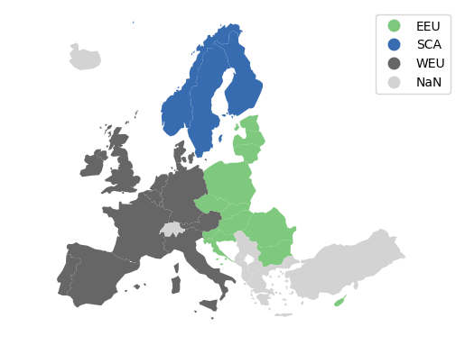

# plot_regions

Plot thumbnails of regional aggregations



## Data

Download NUTS boundaries from [GISCO](https://ec.europa.eu/eurostat/web/gisco/geodata/reference-data/administrative-units-statistical-units/nuts#nuts21)

## Dependencies

These scripts rely upon the following Python libraries

- matplotlib
- pandas
- geopandas

## Use

To use the script, first define a dictionary of country mappings using ISO-3166 two-letter country codes
as the key, and the mapped region (e.g. model specific region) as the value.

```python
from plot_regions import main

regions = {
        'AT' : 'WEU',
        'BE' : 'WEU',
        'BG' : 'EEU',
        'HR' : 'EEU',
        'CY' : 'EEU',
        'CZ' : 'EEU',
        'DK' : 'WEU',
        'EE' : 'EEU',
        'FI' : 'SCA',
        'FR' : 'WEU',
        'DE' : 'WEU',
        'GR' : 'WEU',
        'HU' : 'EEU',
        'IE' : 'WEU',
        'IT' : 'WEU',
        'LV' : 'EEU',
        'LT' : 'EEU',
        'LU' : 'WEU',
        'MT' : 'WEU',
        'NL' : 'WEU',
        'NO' : 'SCA',
        'PL' : 'EEU',
        'PT' : 'WEU',
        'RO' : 'EEU',
        'SK' : 'EEU',
        'SI' : 'EEU',
        'ES' : 'WEU',
        'SE' : 'SCA',
        'UK' : 'WEU',
        }

main(regions)
```

The result is an thumbnail image of European regions colour coded by aggregation.
